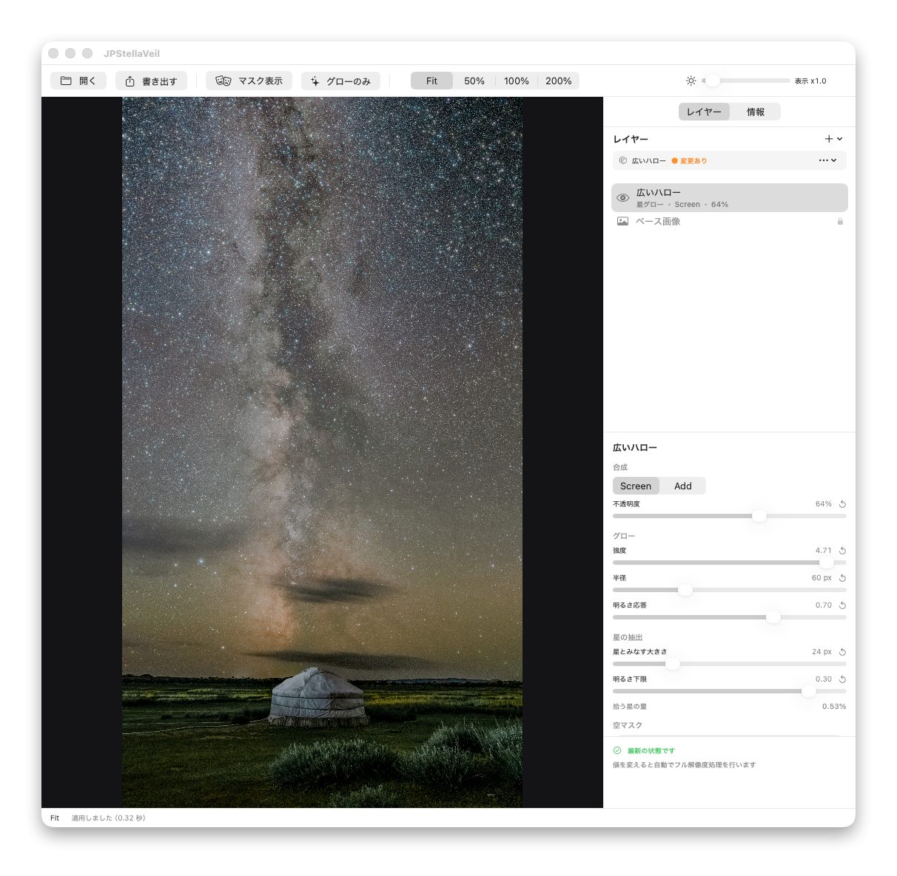

# JPStellaVeil

現像済みの 16bit TIFF に、星空用ソフトフィルターの効果を**あとから**加える macOS アプリです。星の明るさに応じたグローを複数のレイヤーとして重ね、**EXIF や MakerNote を 1 つも落とさずに** 16bit TIFF へ書き出します。



ソフトフィルターは撮影時にレンズへ付けるもので、効き具合を後から変えられません。しかも前景の街灯や建物まで一緒に滲みます。天の川と地上の風景が同居する構図では、これが致命的になります。

同じことは Photoshop でもできます。ただし「**16bit のまま**」「**リニア空間で**」「**空だけに効かせて**」「**メタデータを完全に保って**」という 4 つを同時に満たそうとすると、手数が増えるうえに検証も自前になります。このアプリはその 4 つを既定の動作にしています。

## インストール

[Releases](https://github.com/Junpeiwada/JPStellaVeil/releases/latest) から DMG をダウンロードし、JPStellaVeil を Applications へドラッグしてください。

Apple の公証（notarization）済みなので、警告なしに起動できます。インストール後はアプリが自身で更新を確認します（後述）。

## 動作環境

- macOS 14 以降
- Metal が使える Mac

外部ツールを 2 つ使います。**どちらも無くてもグローの適用と書き出しはできます**が、それぞれの機能が使えなくなります。

| ツール | 用途 | 無いとどうなるか |
|---|---|---|
| **Adobe Photoshop** | 空マスクの生成（「空を選択」を借りる） | 空マスクを作れません。グローは画面全体に効きます |
| **ExifTool** | メタデータの補完と検証 | 書き出しはできますが、メタデータ検証が行われません |

ExifTool は `brew install exiftool` で入ります。未導入のときは、サイドパネルとステータスバーにその旨が表示されます。

## 使い方

1. **16bit TIFF を開く** — ウィンドウへドラッグ＆ドロップ、またはツールバーから
2. **レイヤーを追加** — プリセットバーから「微細グロー」「標準グロー」「広いハロー」のいずれかを選ぶ
3. **調整する** — 右のインスペクタでパラメータを動かす。プレビューは即座に更新される
4. **空マスクを作る**（任意） — 「空マスク」の「作り直す」で Photoshop が起動し、「空を選択」の結果を取り込む
5. **書き出す** — 「TIFF を書き出す」。メタデータを検証し、合格したものだけを保存する

読み込み直後はレイヤーが無く、画像処理も走りません。**レイヤーを追加した時点で処理が始まります**。

### キャンバスの操作

| 操作 | 動作 |
|---|---|
| **スペースキー**（押している間） | 原画と見比べる |
| **Option + クリック / ドラッグ** | スプリット比較。左が原画、右が処理結果になる |
| ドラッグ / 2 本指スクロール | パン |
| Command + スクロール / ピンチ | ズーム |

スプリット比較を解いて全面表示に戻すには、下部の「解除」を押してください。

### 表示の切り替え

| 項目 | 内容 |
|---|---|
| **グローのみ** | 効果だけを表示する。何がどこに乗っているかを確かめる |
| **マスク表示** | 空マスクの範囲を重ねて表示する |
| **表示露出** | 星空はリニアのままでは暗すぎて確認できない。表示だけを持ち上げる（**書き出し結果には影響しない**） |

グローの形は縮小表示では潰れます。**確認は等倍で行ってください。**

## グローのパラメータ

レイヤーごとに設定します。

| 分類 | パラメータ | 意味 |
|---|---|---|
| 合成 | **不透明度** | レイヤーの可視率 |
| 合成 | **合成モード** | `Screen`（意図した見た目を作る標準）と `Add`（光の加算として自然）。どちらもリニア RGB で計算する |
| グロー | **強度** | グローの明るさ。**星の数は変わらない** |
| グロー | **半径** | ハローの広がり。広げすぎると星ではなく空が霞む |
| グロー | **明るさ応答** | 明るい星ほどハローを大きくする。0 では明るさに関わらず同じ形になる |
| 星の抽出 | **星とみなす大きさ** | これより小さい構造を星とみなす。0 にすると空全体が光る |
| 星の抽出 | **明るさ下限** | これより暗い星を捨てる。上げると明るい星だけに絞れる |
| 空マスク | **空マスクを使う** | 生成済みのマスクを効かせるかどうか |

レイヤーは複製できます。**微細なグローと広いハローを別レイヤーで重ねる**のが基本の使い方になります。

処理の流れは、背景減算で天の川や空のかぶりから点像成分を分離 → 閾値で高 ISO ノイズを抑制 → 空マスクで前景を除外 → 4 成分のガウシアン PSF を重ねてグローを生成 → 不透明度を反映して合成、の順です。すべてリニア空間で行います。

## 空マスク

星景写真で厄介なのは、空と地上の境界（木立・稜線・電線）です。ここはヒューリスティックが最も苦手とする形状で、自前で実用精度を出そうとするとセグメンテーションモデルが要ります。

そこで **Photoshop の「空を選択」を借ります**。「作り直す」を押すと AppleScript 経由で Photoshop が開いた画像を処理し、結果のマスクをアプリへ取り込みます。修正が必要なときも Photoshop 側で直すほうが早いです。

初回実行時、システムが Photoshop の操作許可を尋ねます。誤って拒否した場合は、システム設定 →「プライバシーとセキュリティ」→「オートメーション」から許可し直せます。

## プリセット

レイヤー構成を名前を付けて保存し、別の写真へ適用できます。合成モード・不透明度・グロー・星の抽出を保存し、**写真ごとに変わる空マスクは含みません**。

保存先は `~/Library/Application Support/JPStellaVeil/Presets.json` です。

## メタデータの保持と検証

このアプリの「EXIF を一切失わない」は、次の意味で定義しています。

- 入力 TIFF の**画素寸法・ビット深度・方向・ICC プロファイル**を維持します
- **EXIF / GPS / XMP / IPTC / MakerNote / サムネイル**を出力へコピーします
- 書き出し後、入出力のメタデータを ExifTool で比較し、**保持対象に欠落や値の変化があれば書き出しを失敗として扱い、出力ファイルを消します**

ファイルサイズ・更新日時・TIFF のストリップ位置など、画素を再符号化すれば必ず変わる構造タグは比較から除外します。写真情報を示すタグは除外しません。

まず ImageIO の出力をそのまま検証し、タグが揃っていれば ExifTool でのコピーは行いません。ExifTool の書き込みは XMPToolkit の差し替えや有理数の丸めなど、本来不要な差分を持ち込むためで、**欠落を補う必要があるときだけ使います**。

結果はサイドパネルに「比較タグ数 / 除外タグ数」とともに表示されます。

## 自動更新

起動時に更新を確認します（24 時間間隔）。メニューの「JPStellaVeil」→「更新を確認…」からいつでも手動で確認でき、同じメニューの「起動時に自動で更新を確認」で自動確認を切り替えられます。

[Sparkle](https://sparkle-project.org) を使い、更新フィードは GitHub Pages 上の [appcast.xml](https://junpeiwada.github.io/JPStellaVeil/appcast.xml) です。配信物は EdDSA 署名で検証されます。

## ビルド

`.xcodeproj` は生成物なので版管理していません。`project.yml` から生成します。

```sh
brew install xcodegen        # 未インストールなら
xcodegen generate
```

`npm run` でも叩けます（アプリ本体は Swift/Xcode。npm の依存は無く、VSCode の NPM SCRIPTS パネルから実行するために置いています）。

```sh
npm run generate             # xcodegen generate
npm run build                # Debug ビルド
npm run test                 # テスト（182 件）
npm run run                  # ビルドしたアプリを起動
```

### 動作確認用の環境変数

起動時の状態を環境変数で指定できます。スクリーンショット取得や効果の見比べを自動化するための入口です。

| 変数 | 内容 |
|---|---|
| `JPSTELLAVEIL_OPEN_FILE` | 起動時に開く TIFF のパス |
| `JPSTELLAVEIL_ADD_PRESET` | 追加するプリセット（`fine` / `standard` / `wideHalo`） |
| `JPSTELLAVEIL_AUTO_APPLY` | `1` でフル解像度処理まで走らせる |
| `JPSTELLAVEIL_GENERATE_MASK` | `1` で起動時に空マスクを生成する |
| `JPSTELLAVEIL_DISPLAY_EXPOSURE` | 表示露出 |
| `JPSTELLAVEIL_SPLIT` | スプリット比較の位置（`0.5` で左が原画） |
| `JPSTELLAVEIL_ZOOM` | 表示倍率（`100` で等倍） |
| `JPSTELLAVEIL_GLOW_ONLY` | `1` でグローのみ表示 |

### リリース

タグを打つと GitHub Actions が署名・公証・DMG 作成・appcast 更新まで行います。

```sh
npm run release -- 1.2.0     # バージョンを渡して発火
npm run release              # 現在の版を表示して対話入力
```

手順の詳細は [docs/リリース手順.md](docs/リリース手順.md) を参照してください。

## 構成

```
Sources/
├── App/           アプリ本体・画面・状態管理・自動更新
├── Domain/        プロジェクトとプリセットのモデル
├── Imaging/       16bit TIFF の読み書き・ICC プロファイル検査
├── Masking/       空マスク生成（Photoshop 連携）
├── Metadata/      ExifTool 実行・メタデータ比較検証
├── Presets/       プリセットの永続化
├── Processing/    グロー生成の Metal パイプライン
└── Rendering/     Metal キャンバス・ズーム・表示変換
```

| 領域 | 採用技術 |
|---|---|
| UI | SwiftUI |
| 描画 | MetalKit |
| 演算 | Metal Compute（背景減算・空マスク・PSF 畳み込み・合成） |
| TIFF / 色管理 | ImageIO、CoreGraphics、ColorSync |
| メタデータ | ExifTool |
| 自動更新 | Sparkle |

プレビューは画像サイズに応じて縮小し GPU で即時更新します。フル解像度の演算は書き出し時だけ実行し、処理中も最後に確定したプレビューを表示し続けます。

詳細は [docs/アプリ全体像.md](docs/アプリ全体像.md)（全体像）、[docs/技術仕様.md](docs/技術仕様.md)（確定仕様の正本）、[docs/UI.md](docs/UI.md) を参照してください。

## 含まないもの

- RAW 現像 / JPEG 出力 / 汎用レタッチフィルター / 複数画像のスタック合成
- **プロジェクト保存**（`.stellaveil`）— 写真ごとの編集状態を保存して再開する需要が実際には無かったためです。写真をまたいで使い回したいのは設定の「型」のほうで、それはプリセットで満たせています
- **空マスクの自前生成と手動補正**（地平線指定・境界ぼかし・手動ブラシ・レイヤー別マスク）— Photoshop 側で直すほうが早いためです

いずれも検討のうえ実装しないと決めました（2026-08-25）。経緯は [docs/アーカイブ/実装計画.md](docs/アーカイブ/実装計画.md) に記録しています。
